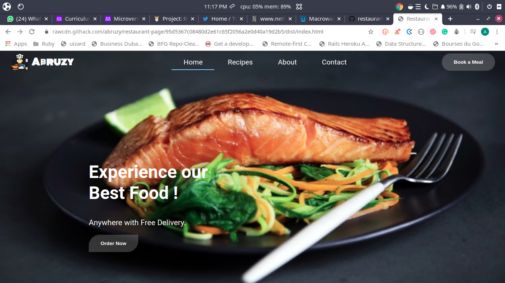

<!-- PROJECT SHIELDS -->
<!--
*** I'm using markdown "reference style" links for readability.
*** Reference links are enclosed in brackets [ ] instead of parentheses ( ).
*** See the bottom of this document for the declaration of the reference variables
*** for contributors-url, forks-url, etc. This is an optional, concise syntax you may use.
*** https://www.markdownguide.org/basic-syntax/#reference-style-links
-->
[![Contributors][contributors-shield]][contributors-url]
[![Forks][forks-shield]][forks-url]
[![Stargazers][stars-shield]][stars-url]
[![Issues][issues-shield]][issues-url]
[![MIT License][license-shield]][license-url]


<!-- PROJECT LOGO -->
<br />
<p align="center">
  <h3 align="center">Restaurant Page App</h3>
  <p align="center">
   This is a restaurant Page made by purely JavaScript,using webpacker and dynamically rendering the entire contents of the website using JavaScript.
    <br />
    <a href="https://github.com/abruzy/restaurant-page/blob/master/README.md"><strong>Explore the docs �</strong></a>
    <br />
    <br />
    <a href="https://www.theodinproject.com/courses/ruby-programming/lessons/advanced-building-blocks.">Assigment</a>
    �
    <a href="https://github.com/abruzy/restaurant-page/issues">Report Bug</a>
    �
    <a href="https://github.com/abruzy/restaurant-page/issues">Request Feature</a>
  </p>
</p>


<!-- TABLE OF CONTENTS -->
## Table of Contents

* [About the Project](#about-the-project)
  * [Built With](#built-with)
* [Getting Started](#getting-started)
  * [Prerequisites](#prerequisites)
  * [Installation](#installation)
* [Usage](#usage)
* [Roadmap](#roadmap)
* [Contributing](#contributing)
* [License](#license)
* [Contact](#contact)
* [Acknowledgements](#acknowledgements)


<!-- ABOUT THE PROJECT -->
## About The Project
Link to the [live](https://rawcdn.githack.com/abruzy/restaurant-page/95d5367c08480d2e61c65f2056a2e0d40a19d2b5/dist/index.html) version

This is a restaurant Page made by purely JavaScript,using webpacker and dynamically rendering the entire contents of the website using JavaScript.
<!-- [![Product Name Screen Shot][product-screenshot]](https://example.com) -->
<p>Index page</p>


### Built With
This progam was made using this technologies
* [JavaScript](https://developer.mozilla.org/en-US/docs/Web/JavaScript)
* eslint
* webpack
* HTML
* CSS


<!-- GETTING STARTED -->
## Getting Started

To get a local copy up and running follow these simple example steps.

### Installation

<!-- 1. Get a free API Key at [https://example.com](https://example.com) -->
1. Clone the repo
```sh
git clone https://github.com/abruzy/restaurant-page
```

<!-- USAGE EXAMPLES -->
## Principles Employed
1. Modules are imported and exported in order to keep the code clean and readable
2. Style and Css loaders are employed by webpacker to integrate the css file into the dist folder
3. Image loaders are employed to load images by webpacker
4. The 'tabbing' design is employed to toggle different contents on the page per time
5. JavaScript is employed for DOM manipulation


<!-- ROADMAP -->
## Roadmap

See the [open issues](https://github.com/abruzy/restaurant-page/issues) for a list of proposed features (and known issues).


<!-- CONTRIBUTING -->
## Contributing

Contributions are what make the open source community such an amazing place to be learn, inspire, and create. Any contributions you make are **greatly appreciated**.

1. Fork the Project
2. Create your Feature Branch (`git checkout -b feature/AmazingFeature`)
3. Commit your Changes (`git commit -m 'Add some AmazingFeature'`)
4. Push to the Branch (`git push origin feature/AmazingFeature`)
5. Open a Pull Request


<!-- LICENSE -->
## License

Distributed under the MIT License. See `LICENSE` for more information.


<!-- CONTACT -->
## Contact


* Abubakar Diallo: [Github](https://github.com/abruzy), [Twitter](https://twitter.com/abruzy01)

Project Link: [https://github.com/abruzy/restaurant-page](https://github.com/abruzy/restaurant-page)

<!-- ACKNOWLEDGEMENTS -->
## Acknowledgements
* [Microverse](https://www.microverse.org/)
* [The Odin Project](https://www.theodinproject.com/)


<!-- MARKDOWN LINKS & IMAGES -->
<!-- https://www.markdownguide.org/basic-syntax/#reference-style-links -->
[contributors-shield]: https://img.shields.io/github/contributors/abruzy/restaurant-page
[contributors-url]: https://github.com/abruzy/restaurant-page/graphs/contributors
[forks-shield]: https://img.shields.io/github/forks/abruzy/restaurant-page
[forks-url]: https://github.com/abruzy/restaurant-page/network/members
[stars-shield]: https://img.shields.io/github/stars/abruzy/restaurant-page
[stars-url]: https://github.com/abruzy/restaurant-page/stargazers
[issues-shield]: https://img.shields.io/github/issues/abruzy/restaurant-page
[issues-url]: https://github.com/abruzy/restaurant-page/issues
[license-shield]: https://img.shields.io/github/license/abruzy/restaurant-page
[license-url]: https://github.com/abruzy/restaurant-page/blob/master/LICENSE.txt

